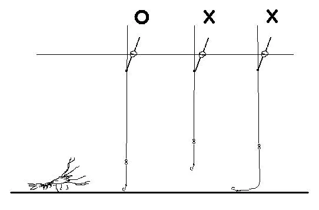
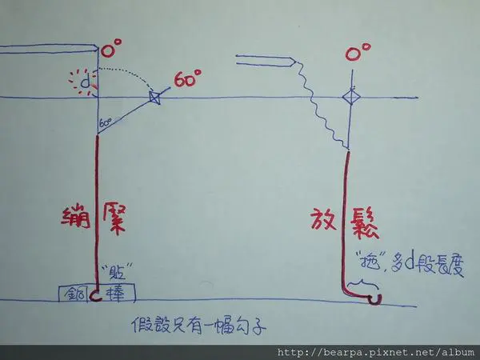
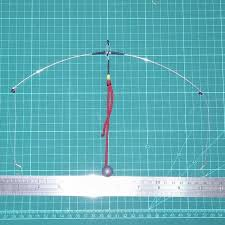

# 浮標量水深
不論蝦場水池是否完全平整, 至蝦場第一件事情除了解環境外, 開始的第一步就是量水深, 以下為量水深的Tips.

## 目標
測水深的主要目的
- 讓浮標訊號有效
- 讓蝦子可以吃到/拉到鉤子

  
上圖表示錯誤的長度造成的影響:
- 適中: 浮標訊號清楚, 蝦子也可以吃到
- 太短: 蝦子可能最多夾到, 沒手的就玩不到, 下沉時其實還沒就口(過度靈敏)
- 太長: 蝦子可能吃了也沒有下沉, 太遲鈍導致浮標沒有參考性

因此水深在各個蝦場是很重要的, 嚴重的話像是某些蝦場水池是不平整甚至歪斜的, 會導致永遠釣不到蝦.

  
此圖描述使用銅棒進行水深測量, 後面會以這個圖片作為說明

  
此圖用於示意天平水深需要透過棒子或者線材延伸重物
## 步驟
- 開釣竿取鉤子/快別
- 掛重物將 鉛塊/銅柱 勾在
  - 長短鉤: 比較短的鉤子上, 也就是較上方的鉤子上
  - 天平: 需要透過棒子或者線材延伸重物, 使重物與鉤子等高
- 將重物透過釣竿放入池底, 並且將釣線拉直垂直水面, 觀察浮標的角度
- 透過浮標姿態(與釣線夾角)辨別線長
  - 0度: 線材過短, 需要將浮標往上移動
  - 30度: 非常靈敏的配置, 只要有蝦子經過或者水流較強可能都會看到訊號
  - 45度: 非常剛好的深度
  - 60度: 些微遲鈍的訊號, 可能要就餌後移動身體才會看到訊號
  - 90度: 線材過長, 可能會毫無訊號, 請將浮標向下移動.  或者 浮標浮力與配重不匹配, 配重不足, 需要配重一些. 
- 收起配重物, 可以開始掛餌釣蝦囉～

注意: 如果需要調整重量, 先參考下面浮標基本三型的文章, 有時間再補上配重與浮標的關係。

## Referencies
- [Youtube-釣蝦傳統浮標座量水深(請選HD高畫質)](https://www.youtube.com/watch?v=q7Kbs_6XuZs)
- [#釣蝦入門（水深篇）（零基礎請進）](https://www.dcard.tw/f/talk/p/228706176)
- [釣泰國蝦非常簡易上手說明 新增浮標基本3型](https://www.mobile01.com/topicdetail.php?f=579&t=1687661)